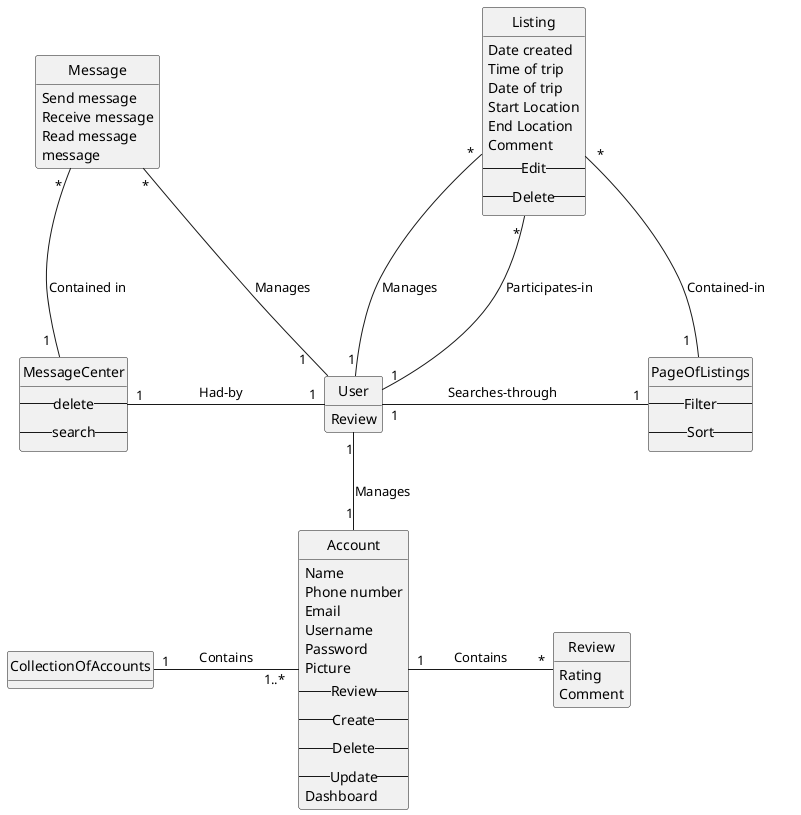
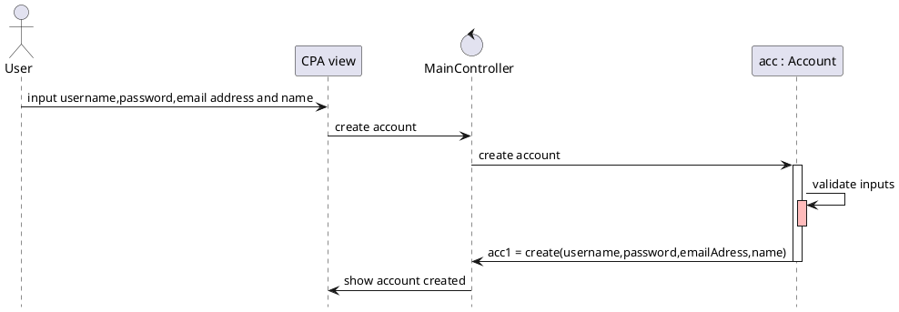

# Domain Model


# Sequence Diagrams

## Account creation


## Listing creation
```plantuml
@startuml
hide footbox

'ACTORS
actor "User" as user
participant "CPA view" as system
control "MainController" as controller
participant "list : Listing" as listing

'ACTIONS
user -> system : input date,time,start-location,end-location and comment
system -> controller : create listing
controller -> listing : create listing

activate listing

listing -> listing : validate inputs
activate listing #CC5500

deactivate listing
listing -> controller : listy = create(date,time,startLoc,endLoc,comment)
deactivate listing

controller -> system : show listing created
@enduml
/'
account -->> profile **: pr = create(name,email_address)
//all constraints done in CPA so it will call on itselfs

participant "list : Listing" as listing
database "Account database" as adatabase
database "Listing database" as ldatabase
SINCE ITS MED RISK TRY TO PUT MOST ATTR AS WE CAN BUT FOR HIGH RISK, ALL ATTR ARE NECESSARY

For first iteration, think of it as building a project like pet trainer so instead of looking if any of the fields are empty after clicking sign up, it does it at every point cuz its more impossible to do at this stage of the process

Profile might be its own class as like a page other users can see (Sam said this would be a good idea and to add all these other attr [picture and below] to profile)

from user -> CPA, user inputs raw data so Input account information is ok

we can maybe delete getUsername and getPassword cuz it would be implied that CPA has the constraints so it has filtered to see if the inputs were good or bad

Maybe move acc = create.... at the bottom so that it makes the account after CPA has done its filtering

Profile could be like UI type thing so it only shows the User's name and email address without exposing any account info

If pr is successfully created, pr pings to CPA that account created

//CPA sends email ping to email server  // fist iteration just make sure the substring vassar.edu is there


Make :CPA -> Cpa view

make a controller

things like account creation, listing creation etc... are different seq models

in class diagram have controller class
method getProfile() etc
review() method
upcoming trip class?
merge user and account
-- Review cannot be an attribute cuz it has comment and rating(int)

'/