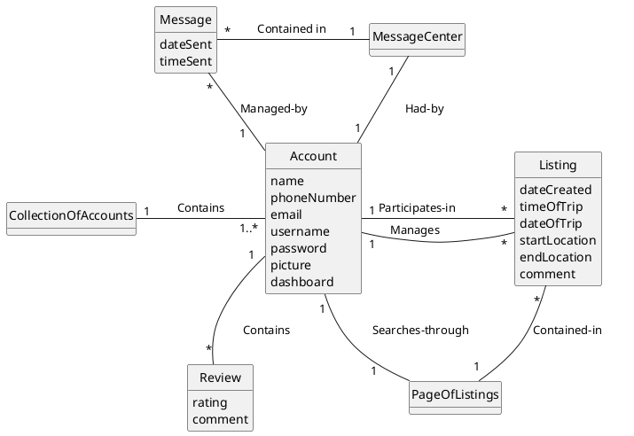
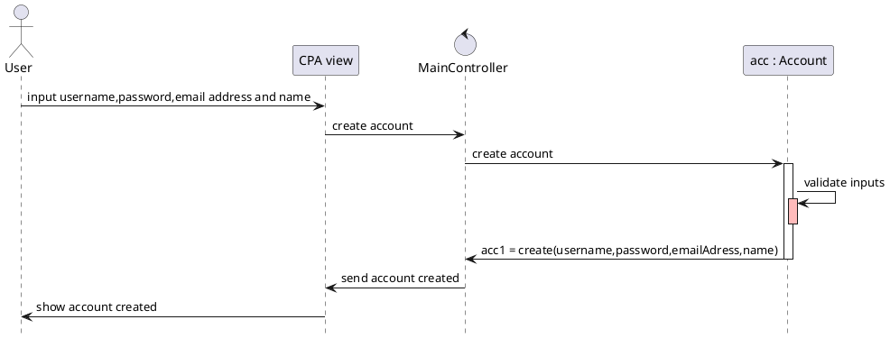
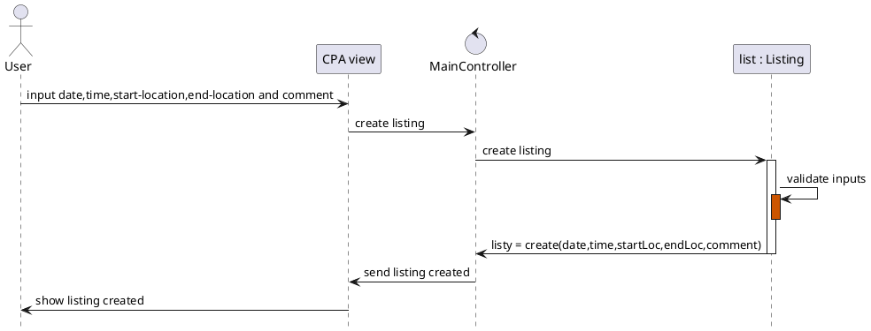
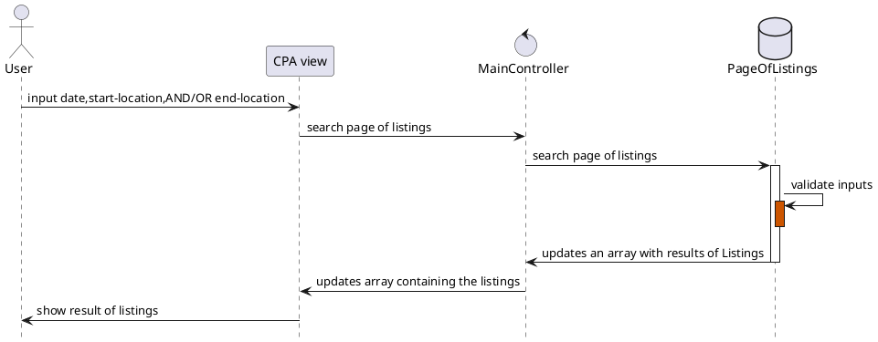
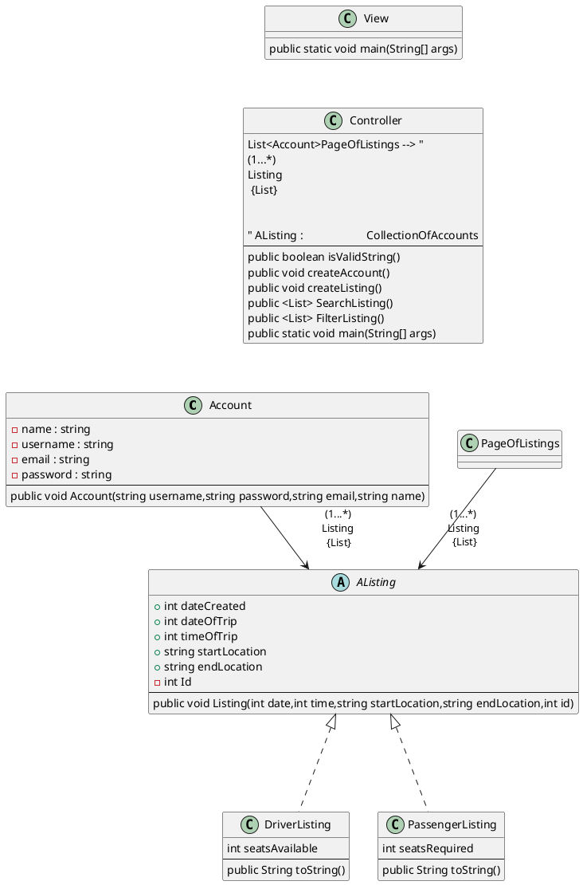

# Domain Model

# Sequence Diagrams

## Account creation

## Listing creation

## Search listings

# Class Diagram

[//]: # (account -->> profile **: pr = createname,email_address)

[//]: # (participant "list : Listing" as listing)

[//]: # (database "Account database" as adatabase)

[//]: # (database "Listing database" as ldatabase)

[//]: # (SINCE ITS MED RISK TRY TO PUT MOST ATTR AS WE CAN BUT FOR HIGH RISK, ALL ATTR ARE NECESSARY)

[//]: # (For first iteration, think of it as building a project like pet trainer so instead of looking if any of the fields are empty after clicking sign up, it does it at every point cuz its more impossible to do at this stage of the process)

[//]: # (from user -> CPA, user inputs raw data so Input account information is ok)

[//]: # (a method called getProfile&#40;&#41; could get the necessary parameters)

[//]: # (If pr/or acc is successfully created, pr pings to CPA that account created)

[//]: # (//CPA sends email ping to email server  // fist iteration just make sure the substring vassar.edu is there)

[//]: # (Make :CPA -> Cpa view)

[//]: # (make a controller)

[//]: # (things like account creation, listing creation etc... are different seq models)

[//]: # (in class diagram have controller class)

[//]: # (method getProfile&#40;&#41; etc)

[//]: # (review&#40;&#41; method)

[//]: # (upcoming trip class?)

[//]: # (-- Review cannot be an attribute cuz it has comment and rating&#40;int&#41;)