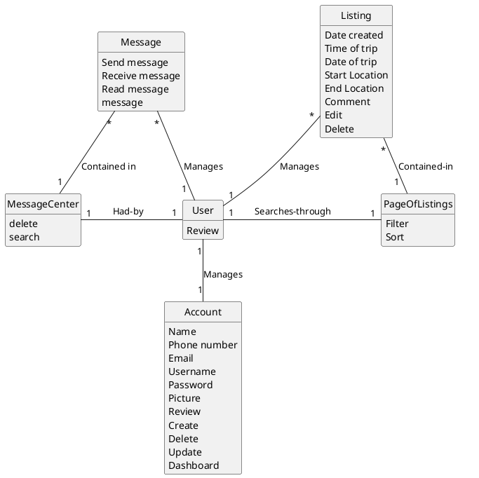

#For Domain model, sequence diagram and class diagram
##Domain Model

```plantuml
@startuml
hide circle
hide empty methods 

'classes
class User{
Review
}
class PageOfListings{
Filter
Sort
}
class Listing{
Date created
Time of trip
Date of trip
Start Location
End Location
Comment
Edit
Delete
}

class Account{
Name
Phone number
Email
Username
Password
Picture
Review
Create
Delete
Update
Dashboard
}

class Message {
Send message
Receive message
Read message
message
}

class MessageCenter{
delete
search
}

' associations
PageOfListings "1  " -left- "*" Listing : Contained-in\t\t
MessageCenter "1" -up- "*" Message: Contained in\t
User "1" -left- "1" MessageCenter : \tHad-by\t\t
User "1" - "1" PageOfListings : \tSearches-through\t\t
User "1" -up- "*" Listing : Manages\t\t
User "1" -- "1" Account : Manages\t\t
User "1  " -up- "*" Message : Manages\t\t

@enduml
```