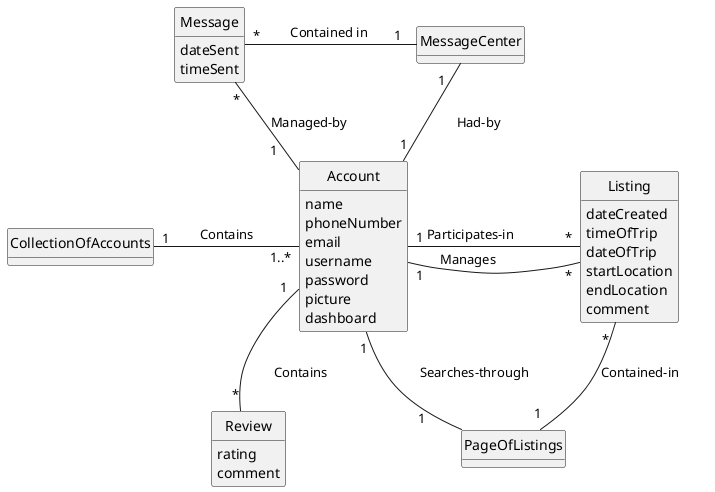
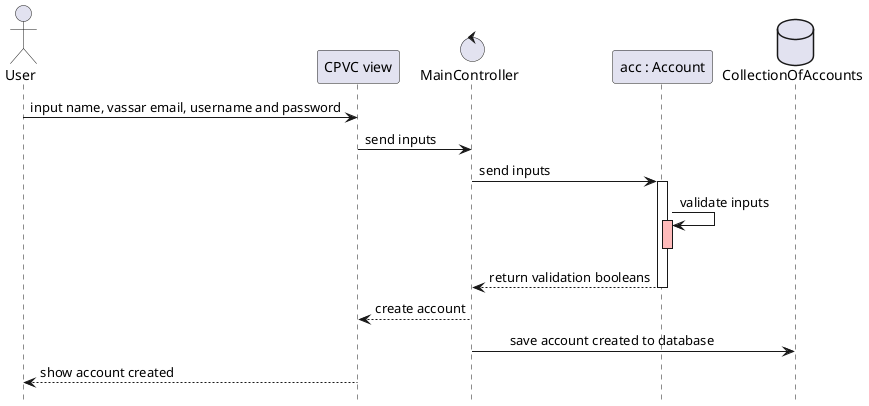
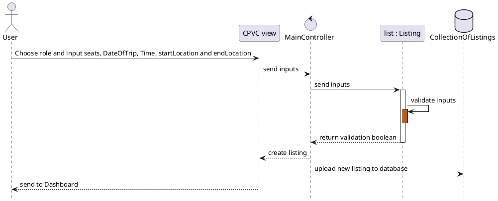
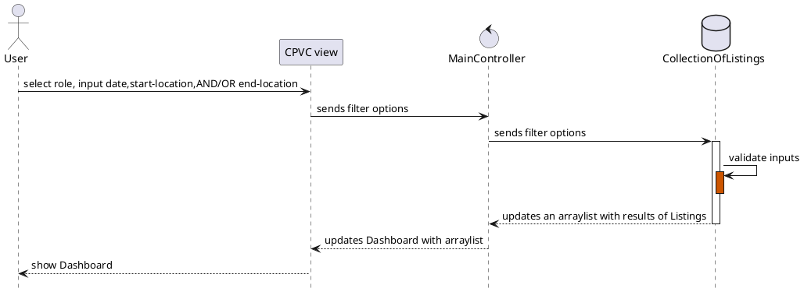
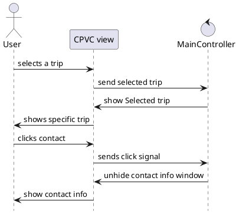
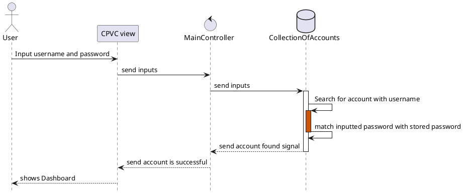
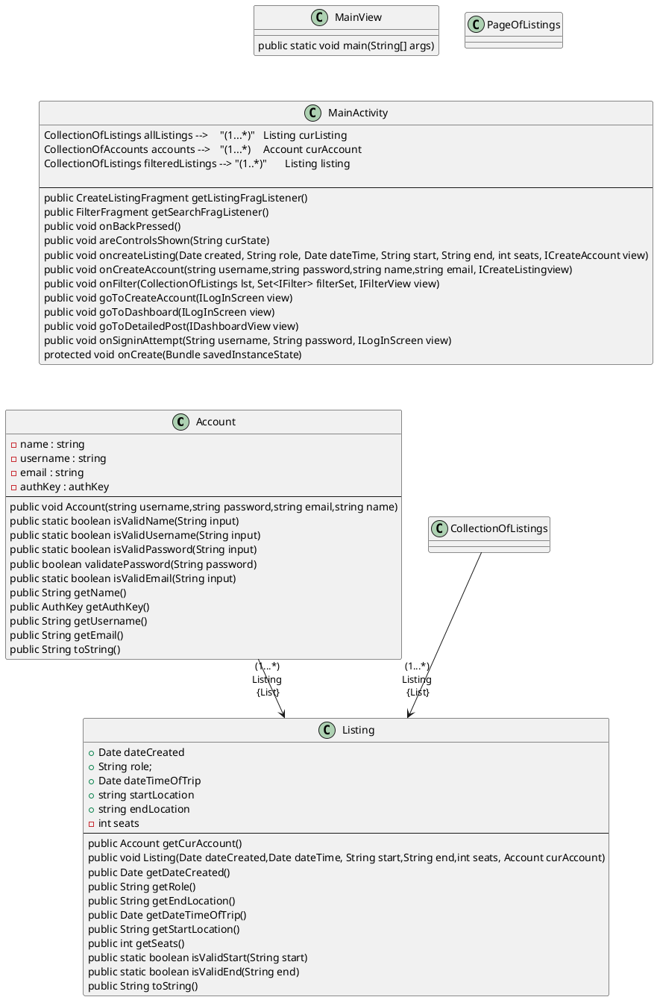

# Domain Model

```plantuml
@startuml
hide circle
hide empty methods 

'classes

class PageOfListings{
}
class Listing{
dateCreated
timeOfTrip
dateOfTrip
startLocation
endLocation
comment
}

class Account{
name
phoneNumber
email
username
password
picture
dashboard
}

class Message {
dateSent
timeSent
}

class MessageCenter{
}

class Review{
rating
comment
}

class CollectionOfAccounts{
}
' associations
PageOfListings "1  " -left- "\t\t\t\t*" Listing : Contained-in\t\t
MessageCenter "1  " -left- "*" Message: \tContained in\t\t
Account "1" -up- "\t\t\t1" MessageCenter : \tHad-by\t\t
Account "1" -up- "1        " PageOfListings : \tSearches-through\t\t
Account "1" -right- "*" Listing : Manages\t\t
Account "1" -up-- "*" Listing : Participates-in\t\t
Account "1    " -up- "*" Message : Managed-by\t\t
Account "1 " -- "*" Review : \tContains\t\t
CollectionOfAccounts "1" -right- "1..*" Account : \tContains\t\t
@enduml
```

# Sequence Diagrams

## Create Account

```plantuml
@startuml
hide footbox

'ACTORS
actor User as user
participant "CPVC view" as system
control "MainController" as controller
participant "acc : Account" as account
database "CollectionOfAccounts" as Adatabase


user -> system : input name, vassar email, username and password 
system -> controller : send inputs
controller -> account : send inputs

activate account

account -> account : validate inputs
activate account #FFBBBB

deactivate account

account --> controller : return validation booleans
deactivate account
controller --> system : create account
controller -> Adatabase : \t save account created to database
system --> user : show account created


@enduml
```

## Create Listing

```plantuml
@startuml
hide footbox

'ACTORS
actor "User" as user
participant "CPVC view" as system
control "MainController" as controller
participant "list : Listing" as listing
database "CollectionOfListings" as ldatabase

'ACTIONS
user -> system : Choose role and input seats, DateOfTrip, Time, startLocation and endLocation
system -> controller : send inputs
controller -> listing : send inputs

activate listing

listing -> listing : validate inputs
activate listing #CC5500

deactivate listing
listing --> controller : return validation boolean
deactivate listing

controller --> system : create listing
controller --> ldatabase : upload new listing to database
system --> user : send to Dashboard
@enduml
```

## Search listings

```plantuml
@startuml
hide footbox

'ACTORS
actor "User" as user
participant "CPVC view" as system
control "MainController" as controller
database "CollectionOfListings" as ldatabase

'ACTIONS
user -> system : select role, input date,start-location,AND/OR end-location 
system -> controller : sends filter options
controller -> ldatabase : sends filter options


activate ldatabase

ldatabase -> ldatabase : validate inputs
activate ldatabase #CC5500

deactivate ldatabase
ldatabase --> controller : updates an arraylist with results of Listings
deactivate ldatabase

controller --> system : updates Dashboard with arraylist
system --> user : show Dashboard

@enduml
```
##Show Specific Trip and clicks Contact

```plantuml
@startuml
hide footbox

'ACTORS
actor "User" as user
participant "CPVC view" as system
control "MainController" as controller

'ACTIONS
user -> system : selects a trip
system -> controller : send selected trip
controller -> system : show Selected trip\t
system -> user : shows specific trip
user -> system : clicks contact
system -> controller : sends click signal
controller -> system : unhide contact info window
system -> user : show contact info
@enduml
```
##Log in

```plantuml
@startuml
hide footbox

'ACTORS 
actor "User" as user
participant "CPVC view" as system
control "MainController" as controller
database "CollectionOfAccounts" as aDatabase

'ACTIONS
user -> system : Input username and password
system -> controller : send inputs 
controller -> aDatabase : send inputs

activate aDatabase
aDatabase -> aDatabase : Search for account with username
activate aDatabase #CC5500
aDatabase -> aDatabase : match inputted password with stored password
deactivate aDatabase
aDatabase --> controller : send account found signal
deactivate aDatabase
controller --> system : send account is successful
system --> user : shows Dashboard 
@enduml
```

# Class Diagram

```plantuml
@startuml

class Account{
-name : string
-username : string
-email : string
-authKey : authKey
--
public void Account(string username,string password,string email,string name)
public static boolean isValidName(String input)
public static boolean isValidUsername(String input)
public static boolean isValidPassword(String input)
public boolean validatePassword(String password)
public static boolean isValidEmail(String input)
public String getName()
public AuthKey getAuthKey()
public String getUsername()
public String getEmail()
public String toString()
}

class Listing{
+Date dateCreated
+String role;
+Date dateTimeOfTrip
+string startLocation
+string endLocation
-int seats
--
public Account getCurAccount()
public void Listing(Date dateCreated,Date dateTime, String start,String end,int seats, Account curAccount)
public Date getDateCreated()
public String getRole()
public String getEndLocation()
public Date getDateTimeOfTrip()
public String getStartLocation()
public int getSeats()
public static boolean isValidStart(String start)
public static boolean isValidEnd(String end)
public String toString()
}


class MainActivity{
CollectionOfListings allListings --> \t "(1...*)"\t Listing curListing 
CollectionOfAccounts accounts --> \t "(1...*)\t Account curAccount
CollectionOfListings filteredListings --> "(1..*)"\t Listing listing

--
public CreateListingFragment getListingFragListener()
public FilterFragment getSearchFragListener()
public void onBackPressed()
public void areControlsShown(String curState)
public void oncreateListing(Date created, String role, Date dateTime, String start, String end, int seats, ICreateAccount view)
public void onCreateAccount(string username,string password,string name,string email, ICreateListingview)
public void onFilter(CollectionOfListings lst, Set<IFilter> filterSet, IFilterView view)
public void goToCreateAccount(ILogInScreen view)
public void goToDashboard(ILogInScreen view)
public void goToDetailedPost(IDashboardView view)
public void onSigninAttempt(String username, String password, ILogInScreen view)
protected void onCreate(Bundle savedInstanceState)
}
class CollectionOfListings{

}
class MainView{
 
public static void main(String[] args)
}
together {
class Account
class PageOfListings
}
'Association
MainView --[hidden] MainActivity
MainActivity -[hidden] CollectionOfListings
MainActivity --[hidden] Account
CollectionOfListings --> "\n(1...*)\nListing\n {List}\n" Listing : \t\t\t
Account --> "\n(1...*)\nListing\n {List}\n" Listing : \t

Account -[hidden] CollectionOfListings
@enduml
```
