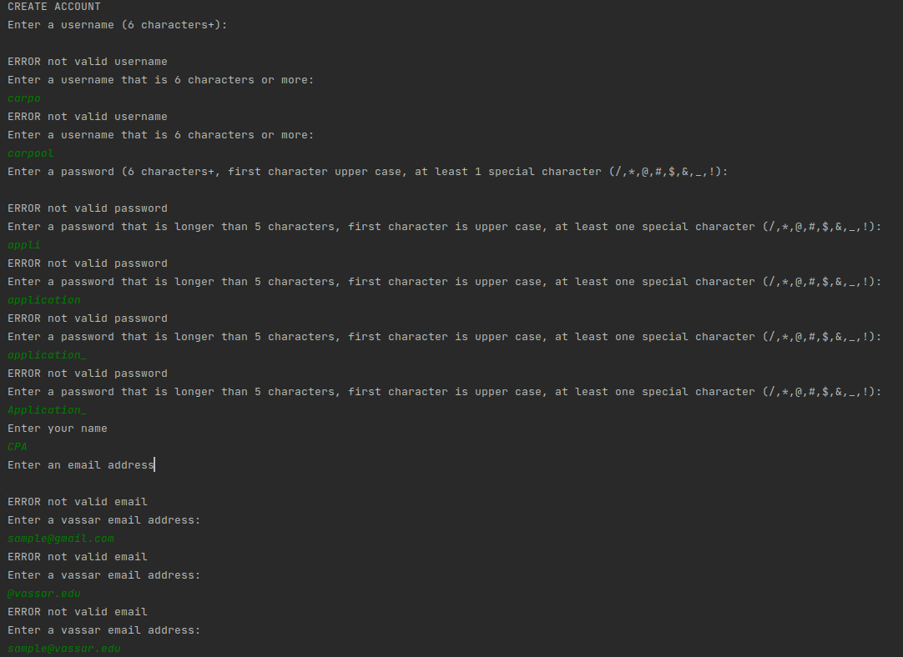
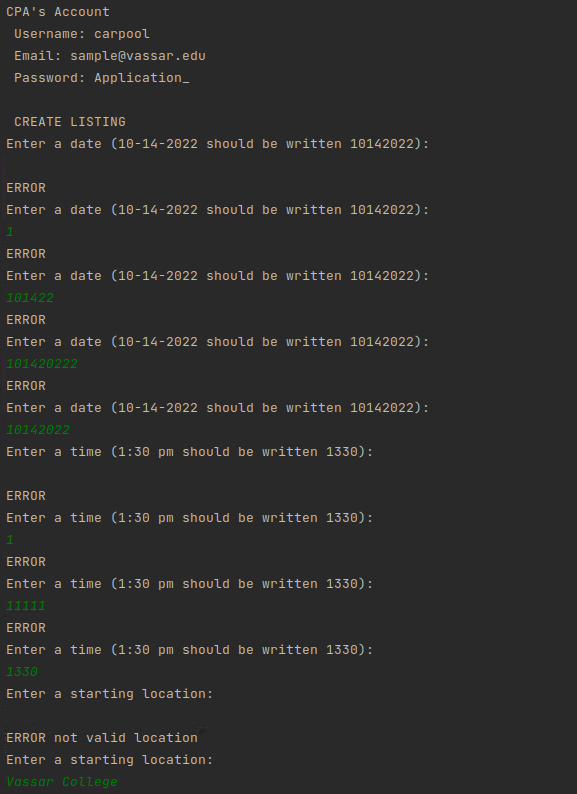
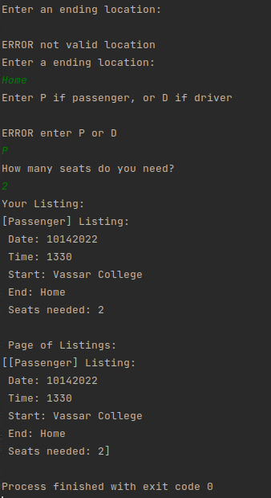
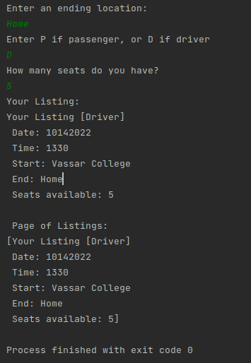

## How the prototype was tested

#### The carpool prototype was tested by inputting all possible instances where the code could break and shown that they have all been covered. The constraints were loose in some cases like name and start/end location since they will be turned into stricter cases in later iterations while others were stricter cases in this iteration like password and email address since they are important in the first iteration.

#### The information is then turned into an account which is displayed to the user. We then tested all the possibles instances in which the code could break to create a listing and shown they were all covered as well.

#### Lastly, we covered the two instances in which the user was a driver or a passenger and used the appropriate methods to output the correct type of listings. All the outputs matched our expectations, both the errors and the successful ones.